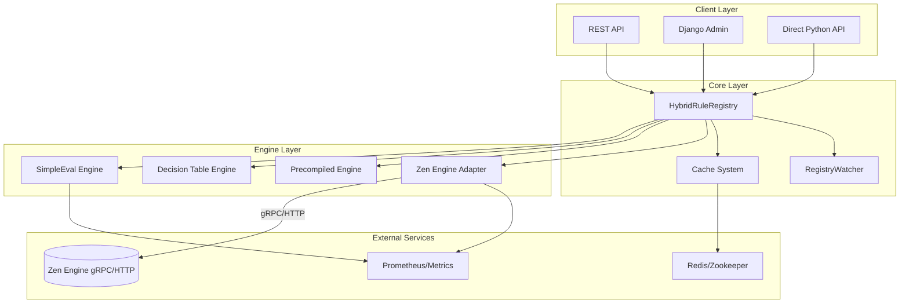
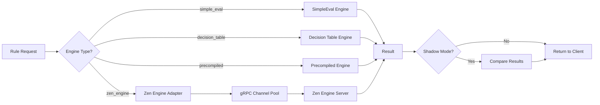

# django-eval

[](https://www.python.org/downloads/)
[](https://www.djangoproject.com/)
[](https://opensource.org/licenses/MIT)

A Django reusable app providing a **secure, configurable hybrid rule engine** supporting both [SimpleEval](https://github.com/danthedeckie/simpleeval) and [Zen Engine](https://github.com/gorules/zen).

It enables you to define, manage, and execute business rules using **decision tables**, **expression-based conditions**, or **Zen Engine rules** with built-in security validation, version management, precompilation for high performance, pluggable cache backends, and seamless multi-engine orchestration.

---

## Table of Contents

- [Features](#features)
- [Architecture](#architecture)
- [Quick Start](#quick-start)
- [Configuration](#configuration)
- [Usage](#usage)
  - [Evaluating a Rule](#evaluating-a-rule)
  - [Using the Precompiled Engine](#using-the-precompiled-engine)
  - [Zen Engine Integration](#zen-engine-integration)
  - [Hybrid Registry & Shadow Mode](#hybrid-registry--shadow-mode)
  - [Defining Decision Table Rules](#defining-decision-table-rules)
  - [Expression Format](#expression-format)
  - [Rule Workflow](#rule-workflow)
  - [Rule Management API](#rule-management-api)
  - [Testing Rules](#testing-rules)
  - [Django Admin](#django-admin)
- [REST API Endpoints](#rest-api-endpoints)
- [Management Commands](#management-commands)
- [Running Tests](#running-tests)
- [Advanced Topics](#advanced-topics)
- [License](#license)

---

## Features

### Core Engines
- **Decision Table Engine** - First-hit policy decision tables with `when/then` rules
- **SimpleEval Expression Engine** - Safe Python expression evaluation with security filtering
- **Zen Engine Adapter** - High-performance rules via [Zen Engine](https://github.com/gorules/zen) (gRPC/HTTP)
- **Hybrid Registry** - Unified multi-engine orchestration with automatic routing

### Performance & Reliability
- **Precompiled Rule Engine** - Compile rules into optimized Python callables for high-throughput scenarios
- **Pluggable Cache Backends** - Support Django Cache, Redis, In-Memory, or Dummy (no-op) backends
- **Hot Reload** - `RegistryWatcher` automatically detects rule changes via version tracking
- **Distributed Locks** - Redis/Zookeeper-backed locks for multi-instance deployments

### Advanced Features
- **Rule Workflow Engine** - Sequential, parallel, conditional, and loop-based rule orchestration
- **Shadow Mode** - Dual-engine execution for safe migration and result comparison
- **Auto Conversion** - Transform decision tables to Zen Engine format with safety checks
- **ML Tuning Assistant** - Performance analysis and anomaly detection for rule optimization

### Management & Operations
- **Version Management** - Full rule version history with publish/rollback support
- **Built-in Functions** - Time-based helpers, severity scoring, math utilities
- **Test Framework** - Built-in rule testing and test suite execution
- **Import/Export** - JSON/YAML rule serialization for backup and migration
- **Telemetry** - OpenTelemetry integration with Prometheus metrics export
- **Django Admin Integration** - Full CRUD management via Django Admin with visual editor
- **REST API** - Complete REST API for rule CRUD, evaluation, testing, and validation

### Security & Configuration
- **Security** - Expression validator blocks dangerous patterns (`__import__`, `eval`, `os`, etc.)
- **Configurable Settings** - All behavior customizable via `EVAL_ENGINE_*` Django settings

---

## Architecture



### Engine Selection Flow



---

## Quick Start

### 1. Install

```bash
pip install django-eval
```

For Redis cache support:

```bash
pip install django-eval[redis]
```

### 2. Add to `INSTALLED_APPS`

```python
INSTALLED_APPS = [
    ...
    'rest_framework',
    'eval_engine',
]
```

### 3. Include URLs

```python
from django.urls import path, include

urlpatterns = [
    ...
    path('api/eval-engine/', include('eval_engine.urls')),
]
```

### 4. Run migrations

```bash
python manage.py migrate eval_engine
```

### 5. (Optional) Load default rules

```bash
python manage.py init_rules
```

---

## Configuration

All settings use the `EVAL_ENGINE_` prefix and can be defined in your Django `settings.py`:

```python
# Cache configuration
EVAL_ENGINE_CACHE_ENABLED = True
EVAL_ENGINE_CACHE_BACKEND = 'django'  # 'django' | 'memory' | 'redis' | 'dummy'
EVAL_ENGINE_CACHE_TTL = 300  # seconds

# Engine behavior
EVAL_ENGINE_DEFAULT_TIMEOUT_MS = 100
EVAL_ENGINE_EXPRESSION_MAX_LENGTH = 2000
EVAL_ENGINE_FALLBACK_ON_ERROR = True

# Registry watcher (hot reload)
EVAL_ENGINE_REGISTRY_WATCHER_ENABLED = True
EVAL_ENGINE_REGISTRY_WATCHER_INTERVAL = 5  # seconds

# Audit logging
EVAL_ENGINE_AUDIT_LOG_ENABLED = False
EVAL_ENGINE_AUDIT_LOG_CALLBACK = 'myapp.utils.log_rule_evaluation'
```

### Cache Backends

django-eval supports multiple cache backends via the `EVAL_ENGINE_CACHE_BACKEND` setting:

| Backend | Description | Requirements |
|---|---|---|
| `django` | Uses Django's configured cache framework (default) | None |
| `memory` | Thread-safe in-memory cache with TTL | None |
| `redis` | Direct Redis connection | `pip install django-eval[redis]` |
| `dummy` | No-op cache (for testing) | None |

**Auto-fallback**: If the configured backend fails to initialize (e.g., Redis unavailable), the system automatically falls back to `MemoryCacheBackend`.

**Disable caching**:

```python
EVAL_ENGINE_CACHE_ENABLED = False
```

---

## Usage

### Evaluating a Rule

The primary way to evaluate rules is through the `ConfigurableRuleEngine`:

```python
from eval_engine.configurable_rule_engine import ConfigurableRuleEngine

engine = ConfigurableRuleEngine()
result = engine.evaluate('my_rule', {
    'severity': 'critical',
    'alert_count_1h': 15,
    'business_id': 'P0',
})

print(result.matched)        # True/False
print(result.action)         # {"should_push": True, "channel": "im_urgent"}
print(result.latency_ms)     # 0.523
print(result.trace_id)       # "uuid-for-tracing"
print(result.fallback)       # False (True if error occurred)
```

**With business group override**:

```python
result = engine.evaluate(
    'my_rule',
    context={'severity': 'critical'},
    business_group='ecommerce'
)
```

### Using the Precompiled Engine

For high-throughput scenarios, use the precompiled engine:

```python
from eval_engine.compiled_rule_engine import RuleRegistry

registry = RuleRegistry()
```

### Zen Engine Integration

**Install Zen Engine dependencies:**

```bash
pip install django-eval[zen]
# Or manually:
pip install grpcio grpc-tools
```

**Configure Zen Engine connection in `settings.py`:**

```python
EVAL_ENGINE_ZEN_CONFIG = {
    'enabled': True,
    'grpc_endpoint': 'localhost:50051',  # Zen Engine gRPC address
    'http_endpoint': 'http://localhost:8080',  # Fallback HTTP endpoint
    'timeout_ms': 1000,
    'max_retries': 3,
}
```

**Create a Zen Engine rule:**

```python
from eval_engine.models import Rule

rule = Rule.objects.create(
    name='vip_discount_check',
    code='vip_discount',
    engine_type='zen_engine',  # Specify Zen Engine
    zen_definition={
        'rules': [
            {
                'name': 'VIP Gold Discount',
                'condition': {'all': [
                    {'fact': 'user', 'operator': '==', 'value': 'gold'},
                    {'fact': 'amount', 'operator': '>=', 'value': 100}
                ]},
                'action': {'discount': 0.2}
            }
        ]
    },
    is_active=True
)
```

**Evaluate with Zen Engine:**

```python
from eval_engine.adapters import ZenEngineAdapter

adapter = ZenEngineAdapter()
result = adapter.evaluate('vip_discount_check', {
    'user': 'gold',
    'amount': 150
})

print(result.matched)   # True
print(result.action)    # {'discount': 0.2}
```

### Hybrid Registry & Shadow Mode

**Use the unified registry for multi-engine support:**

```python
from eval_engine.registry import HybridRuleRegistry

registry = HybridRuleRegistry()

# Automatic engine routing based on rule's engine_type
result = registry.evaluate('vip_discount_check', {
    'user': 'gold',
    'amount': 150
})
```

**Enable Shadow Mode for safe migration:**

```python
# Compare SimpleEval and Zen Engine results
result = registry.evaluate(
    'vip_discount_check',
    {'user': 'gold', 'amount': 150},
    shadow_mode=True  # Runs both engines and compares
)

print.result.shadow_result)       # Result from second engine
print(result.shadow_match)        # True if both engines agree
print(result.performance_delta)   # Latency difference in ms
```

**Convert Decision Table to Zen format:**

```python
from eval_engine.converters import DecisionTableToZen

converter = DecisionTableToZen()
zen_json = converter.convert(rule)

# Check for conversion warnings (e.g., short-circuit logic)
if converter.warnings:
    print("Conversion warnings:", converter.warnings)
```

### Rule Workflow

For complex business processes, use the workflow engine to orchestrate multiple rules:

```python
from eval_engine.workflow import RuleWorkflow, SequentialStep, ParallelStep, ConditionalStep

# Define a workflow
workflow = RuleWorkflow(name='order_processing')

# Sequential steps: Run rules in order
workflow.add_step(SequentialStep(
    name='validation',
    rule_codes=['fraud_check', 'inventory_check']
))

# Parallel steps: Run rules concurrently
workflow.add_step(ParallelStep(
    name='risk_assessment',
    rule_codes=['credit_risk', 'shipping_risk', 'user_risk']
))

# Conditional step: Branch based on previous results
workflow.add_step(ConditionalStep(
    name='approval_branch',
    condition=lambda ctx: ctx.get('total_amount', 0) > 1000,
    true_steps=[SequentialStep(rule_codes=['manager_approval'])],
    false_steps=[SequentialStep(rule_codes=['auto_approve'])]
))

# Execute workflow
result = workflow.execute(context={'order_id': '12345', 'total_amount': 1500})
print(result.outputs)  # Aggregated results from all steps
```

### Using the Precompiled Engine (continued)

For high-throughput scenarios, use the precompiled engine:

```python
registry.load_from_db()

# Evaluate all active push_decision rules
tables = registry.get_all_active(rule_type='push_decision')
for table in tables:
    result = table.evaluate(context)
    if not result.get('fallback'):
        print(f"Rule {table.rule_id} matched: {result}")

# Direct lookup
table = registry.get('my_rule')
if table:
    result = table.evaluate(context)
```

### Defining Decision Table Rules

Decision tables use a first-hit policy with `when/then` rules:

```json
{
    "format": "decision_table",
    "table": {
        "kind": "DecisionTable",
        "hitPolicy": "first",
        "inputs": [
            {"name": "level", "field": "level", "type": "string"},
            {"name": "alert_count_1h", "field": "alert_count_1h", "type": "number"}
        ],
        "outputs": [
            {"name": "should_push", "field": "should_push", "type": "boolean"},
            {"name": "action", "field": "action", "type": "string"},
            {"name": "channel", "field": "channel", "type": "string"}
        ],
        "rules": [
            {
                "id": "rule_0",
                "description": "Critical alert with high frequency -> urgent push",
                "when": {"level": "critical", "alert_count_1h": ">10"},
                "then": {"should_push": true, "action": "send", "channel": "im_urgent"}
            },
            {
                "id": "rule_1",
                "description": "Normal alert -> standard push",
                "when": {"level": "warning"},
                "then": {"should_push": true, "action": "send", "channel": "im_normal"}
            },
            {
                "id": "rule_default",
                "description": "Default fallback",
                "when": {},
                "then": {"should_push": false, "action": "suppress"}
            }
        ]
    }
}
```

**Supported condition operators**:

| Operator | Example | Description |
|---|---|---|
| Exact match | `{"field": "value"}` | Equals |
| Greater than | `{"field": ">10"}` | > |
| Less than | `{"field": "<5"}` | < |
| Greater/equal | `{"field": ">=10"}` | >= |
| Less/equal | `{"field": "<=5"}` | <= |
| Not equal | `{"field": "!=value"}` | != |
| Range | `{"field": [1, 10]}` | Between (inclusive) |
| List (IN) | `{"field": ["a", "b"]}` | In list |
| Passthrough | `{"when": {}, ...}` | Always match |

### Expression Format

For complex logic, use SimpleEval expressions:

```json
{
    "format": "simpleeval",
    "conditions": {
        "expression": "severity == 'critical' and alert_count_1h > 10 and business_id in ['P0', 'P1']"
    },
    "actions": {
        "on_match": {"should_push": true, "channel": "im_urgent"},
        "on_mismatch": {"should_push": false, "reason": "rule_not_matched"}
    },
    "context": {
        "required_fields": ["severity", "alert_count_1h", "business_id"]
    }
}
```

**Built-in functions available in expressions**:

- **Math**: `len`, `max`, `min`, `sum`, `abs`, `round`, `clamp`, `between`
- **Time**: `in_business_hours()`, `is_weekend()`, `is_workday()`, `current_hour()`, `current_day_of_week()`
- **Scoring**: `severity_score('critical')`, `priority_score('P0')`, `alert_frequency_trend(count_1h, count_1d)`

**Custom function registration**:

```python
from eval_engine.configurable_rule_engine import RuleFunctionRegistry

def my_custom_func(value):
    return value * 2

RuleFunctionRegistry.register('double', my_custom_func)
# Now usable in expressions: "double(predicted_weight) > 1.0"
```

### Rule Management API

Create, update, and manage rules programmatically:

```python
from eval_engine.configurable_rule_engine import ConfigurableRuleEngine

engine = ConfigurableRuleEngine()

# Create a new rule
result = engine.create_rule({
    'rule_id': 'my_new_rule',
    'rule_name': 'My New Rule',
    'rule_type': 'push_decision',
    'conditions': {
        'format': 'simpleeval',
        'expression': "severity == 'critical'"
    },
    'actions': {
        'on_match': {'should_push': True},
        'on_mismatch': {'should_push': False}
    }
}, created_by='admin')

# Update an existing rule
engine.update_rule(
    'my_new_rule',
    rule_data={'rule_name': 'Updated Name'},
    changed_by='admin',
    change_comment='Updated rule name'
)

# Rollback to a previous version
engine.rollback_rule('my_new_rule', to_version=2)
```

### Testing Rules

Test individual rules or run full test suites:

```python
# Test a single rule
result = engine.test_rule('my_rule', {
    'severity': 'critical',
    'alert_count_1h': 15
})
# Returns: {"success": true, "matched": true, "action": {...}, "latency_ms": 0.5}

# Run a test suite
result = engine.run_test_suite('my_rule', [
    {
        'name': 'critical_high_freq',
        'context': {'severity': 'critical', 'alert_count_1h': 15},
        'expected_matched': True,
        'expected_action': {'should_push': True}
    },
    {
        'name': 'info_low_freq',
        'context': {'severity': 'info', 'alert_count_1h': 1},
        'expected_matched': False
    }
])
# Returns: {"total": 2, "passed": 2, "failed": 0, "pass_rate": 1.0, "results": [...]}

# Validate expression syntax
result = engine.validate_expression_syntax("severity == 'critical' and alert_count_1h > 10")
# Returns: {"valid": true, "message": "Expression is valid"}
```

### Django Admin

django-eval provides a fully-featured Django Admin interface with custom templates:

1. Navigate to `/admin/eval_engine/ruleconfig/`
2. Rule list page includes quick action links (health check, expression validator, batch test)
3. Rule edit page includes:
   - Inline version history (read-only)
   - JSON-formatted rule content editor
   - Embedded quick test panel (input JSON context and run test inline)

**Admin templates included**:

- `eval_engine/admin/ruleconfig/change_list.html` - List view with action buttons
- `eval_engine/admin/ruleconfig/change_form.html` - Edit view with inline test panel

---

## REST API Endpoints

### Rule Evaluation

| Method | Endpoint | Description |
|---|---|---|
| POST | `/api/eval-engine/evaluate` | Evaluate a rule against context |

Request body:

```json
{
    "rule_id": "my_rule",
    "context": {"severity": "critical", "alert_count_1h": 15},
    "business_group": "ecommerce"
}
```

### Rule CRUD

| Method | Endpoint | Description |
|---|---|---|
| GET | `/api/eval-engine/rules` | List all rules |
| POST | `/api/eval-engine/rules` | Create a new rule |
| GET | `/api/eval-engine/rules/<rule_id>` | Get rule detail |
| PUT | `/api/eval-engine/rules/<rule_id>` | Update a rule |
| DELETE | `/api/eval-engine/rules/<rule_id>` | Deactivate a rule |

### Rule Testing

| Method | Endpoint | Description |
|---|---|---|
| POST | `/api/eval-engine/rules/<rule_id>/test` | Test single rule with context |
| POST | `/api/eval-engine/rules/<rule_id>/test-suite` | Run test suite |
| POST | `/api/eval-engine/rules/validate` | Validate expression syntax |

### Rule Versions

| Method | Endpoint | Description |
|---|---|---|
| POST | `/api/eval-engine/rules/<rule_id>/publish` | Publish a version |
| POST | `/api/eval-engine/rules/<rule_id>/rollback` | Rollback to version |
| GET | `/api/eval-engine/rules/<rule_id>/versions` | Get version history |

### Visual Editor API

| Method | Endpoint | Description |
|---|---|---|
| GET | `/api/eval-engine/rule-config` | List rules for visual editor |
| POST | `/api/eval-engine/rule-config` | Create rule via editor |
| GET | `/api/eval-engine/rule-config/<rule_id>` | Get rule for editor |
| PUT | `/api/eval-engine/rule-config/<rule_id>` | Update rule via editor |
| DELETE | `/api/eval-engine/rule-config/<rule_id>` | Delete rule |
| GET | `/api/eval-engine/rule-config/field-schema` | Get available field schema |
| GET | `/api/eval-engine/rule-config/templates` | Get rule templates |
| POST | `/api/eval-engine/rule-config/test-all` | Test all rules against context |
| POST | `/api/eval-engine/rule-config/validate` | Validate rule content |
| GET | `/api/eval-engine/rule-config/<rule_id>/history` | Get rule history |

### System

| Method | Endpoint | Description |
|---|---|---|
| GET | `/api/eval-engine/health` | Engine health check |

---

## Management Commands

### `init_rules`

Initialize default rules from a JSON fixture file:

```bash
python manage.py init_rules
```

Options:

- `--force` - Overwrite existing rules
- `--dry-run` - Validate only, don't write to database
- `--fixture <path>` - Use a custom fixture file

Example fixture format:

```json
{
    "_meta": {"version": "1.0", "description": "Default rules"},
    "rules": [
        {
            "rule_id": "default_push",
            "rule_name": "Default Push Rule",
            "rule_type": "push_decision",
            "engine_type": "simpleeval",
            "scope": "global",
            "priority": 100,
            "is_active": true,
            "rule_content": {
                "format": "decision_table",
                "table": {
                    "kind": "DecisionTable",
                    "inputs": [{"name": "level", "field": "level", "type": "string"}],
                    "outputs": [{"name": "action", "field": "action", "type": "string"}],
                    "rules": [
                        {"id": "rule_default", "when": {}, "then": {"action": "send"}}
                    ]
                }
            }
        }
    ]
}
```

---

## Running Tests

Using the built-in test runner:

```bash
cd django-eval
python runtests.py
```

Using pytest:

```bash
pip install pytest pytest-django
pytest tests/
```

Test files included:

- `tests/test_cache.py` - Cache backend tests (memory, dummy, settings)
- `tests/test_simple_rule_engine.py` - Decision table engine tests
- `tests/test_configurable_rule_engine.py` - Expression engine and test framework tests
- `tests/test_compiled_rule_engine.py` - Precompiled engine and registry tests

---

## Advanced Topics

### Custom Audit Logging

Configure a callback to receive evaluation results:

```python
# settings.py
EVAL_ENGINE_AUDIT_LOG_ENABLED = True
EVAL_ENGINE_AUDIT_LOG_CALLBACK = 'myapp.utils.log_rule_evaluation'

# myapp/utils.py
def log_rule_evaluation(result_dict):
    # result_dict contains: trace_id, rule_id, matched, action, latency_ms, etc.
    MyAuditLog.objects.create(
        trace_id=result_dict['trace_id'],
        rule_id=result_dict['rule_id'],
        matched=result_dict['matched'],
        latency_ms=result_dict['latency_ms']
    )
```

### Programmatic Cache Access

Access the cache directly for advanced use cases:

```python
from eval_engine.cache import get_cache

cache = get_cache()
cache.set('my_key', {'data': 'value'}, timeout=300)
value = cache.get('my_key')
cache.delete('my_key')
```

### Security Considerations

The expression validator blocks these dangerous patterns by default:

- `__import__`, `eval`, `exec`, `compile`
- `os.`, `sys.`, `subprocess.`, `socket.`
- `urllib`, `requests.`
- `class`, `lambda`, `yield`, `del`
- Double-underscore attributes (`__xxx__`)

Customize forbidden patterns:

```python
# settings.py
EVAL_ENGINE_FORBIDDEN_PATTERNS = [
    r'__\w+__',
    r'import\s+',
    # Add your own patterns
]
```

### Production Deployment Tips

**1. gRPC Connection Pooling (Zen Engine)**

```python
# Use persistent channels for high throughput
EVAL_ENGINE_ZEN_CONFIG = {
    'grpc_endpoint': 'zen-engine.prod:50051',
    'max_channel_pools': 10,
    'channel_recycle_timeout': 300,  # seconds
}
```

**2. Distributed Locks for Multi-Instance Deployments**

```python
# settings.py
EVAL_ENGINE_LOCK_BACKEND = 'redis'  # or 'zookeeper'
EVAL_ENGINE_REDIS_URL = 'redis://redis-cluster:6379/0'
```

**3. Telemetry & Monitoring**

```python
# Enable OpenTelemetry tracing
EVAL_ENGINE_TELEMETRY_ENABLED = True
EVAL_ENGINE_OTEL_EXPORTER = 'prometheus'  # or 'jaeger', 'zipkin'

# Access metrics
from eval_engine.telemetry import MetricsCollector
metrics = MetricsCollector()
print(metrics.get_latency_histogram('my_rule'))
```

**4. Performance Profiling**

```python
from eval_engine.profiling import PerformanceProfiler

profiler = PerformanceProfiler()
stats = profiler.get_rule_stats('my_rule')
print(f"P50: {stats.p50_ms}ms, P99: {stats.p99_ms}ms")
```

---

## License

This project is licensed under the MIT License - see the [LICENSE](LICENSE) file for details.

```
MIT License

Copyright (c) 2026 Dakken Team

Permission is hereby granted, free of charge, to any person obtaining a copy
of this software and associated documentation files (the "Software"), to deal
in the Software without restriction, including without limitation the rights
to use, copy, modify, merge, publish, distribute, sublicense, and/or sell
copies of the Software, and to permit persons to whom the Software is
furnished to do so, subject to the following conditions:

The above copyright notice and this permission notice shall be included in all
copies or substantial portions of the Software.

THE SOFTWARE IS PROVIDED "AS IS", WITHOUT WARRANTY OF ANY KIND, EXPRESS OR
IMPLIED, INCLUDING BUT NOT LIMITED TO THE WARRANTIES OF MERCHANTABILITY,
FITNESS FOR A PARTICULAR PURPOSE AND NONINFRINGEMENT. IN NO EVENT SHALL THE
AUTHORS OR COPYRIGHT HOLDERS BE LIABLE FOR ANY CLAIM, DAMAGES OR OTHER
LIABILITY, WHETHER IN AN ACTION OF CONTRACT, TORT OR OTHERWISE, ARISING FROM,
OUT OF OR IN CONNECTION WITH THE SOFTWARE OR THE USE OR OTHER DEALINGS IN THE
SOFTWARE.
```