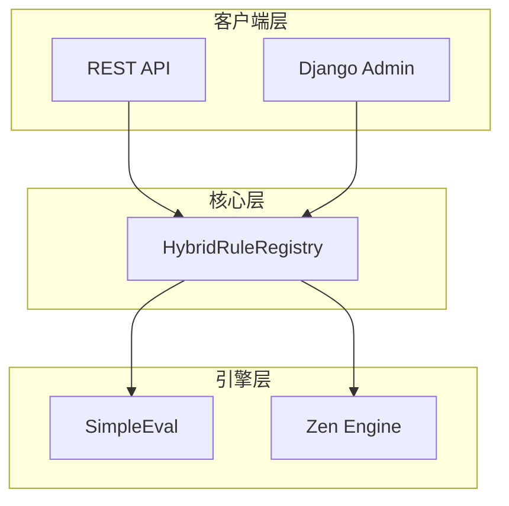

# django-eval

[](https://www.python.org/downloads/)
[](https://www.djangoproject.com/)
[](https://opensource.org/licenses/MIT)

一个 Django 可复用应用，提供**安全、可配置的混合规则引擎**，同时支持 [SimpleEval](https://github.com/danthedeckie/simpleeval) 和 [Zen Engine](https://github.com/gorules/zen)。

您可以使用**决策表**、**表达式条件**或**Zen Engine 规则**来定义、管理和执行业务规则，具备内置的安全验证、版本管理、预编译高性能、可插拔缓存后端以及无缝的多引擎编排能力。

---

## 目录

- [功能特性](#功能特性)
- [架构设计](#架构设计)
- [快速开始](#快速开始)
- [配置说明](#配置说明)
- [使用指南](#使用指南)
- [REST API 端点](#rest-api-端点)
- [管理命令](#管理命令)
- [运行测试](#运行测试)
- [高级主题](#高级主题)
- [许可证](#许可证)

---

## 功能特性

### 核心引擎
- **决策表引擎** - 采用首次命中策略的决策表，支持 `when/then` 规则
- **SimpleEval 表达式引擎** - 安全的 Python 表达式求值，带安全过滤
- **Zen Engine 适配器** - 通过 [Zen Engine](https://github.com/gorules/zen) 实现高性能规则执行 (gRPC/HTTP)
- **混合注册表** - 统一的多引擎编排，支持自动路由

### 性能与可靠性
- **预编译规则引擎** - 将规则编译为优化的 Python 可调用对象
- **可插拔缓存后端** - 支持 Django Cache、Redis、内存或 Dummy 后端
- **热重载** - `RegistryWatcher` 自动检测规则变更
- **分布式锁** - 基于 Redis/Zookeeper 的锁

### 高级功能
- **规则工作流引擎** - 顺序、并行、条件和循环的规则编排
- **影子模式** - 双引擎执行，用于安全迁移和结果对比
- **自动转换** - 决策表转 Zen Engine 格式
- **ML 调优助手** - 性能分析和异常检测

### 管理与运维
- **版本管理** - 完整的规则版本历史，支持发布/回滚
- **测试框架** - 内置规则测试和测试套件执行
- **导入/导出** - JSON/YAML 规则序列化
- **遥测** - OpenTelemetry 集成，Prometheus 指标导出
- **Django Admin 集成** - 可视化编辑器
- **REST API** - 完整的 REST API

---

## 架构设计



---

## 快速开始

### 1. 安装

```bash
pip install django-eval
```

### 2. 添加到 INSTALLED_APPS

```python
INSTALLED_APPS = ['rest_framework', 'eval_engine']
```

### 3. 运行迁移

```bash
python manage.py migrate eval_engine
```

---

## 配置说明

```python
EVAL_ENGINE_CACHE_BACKEND = 'redis'
EVAL_ENGINE_ZEN_CONFIG = {
    'enabled': True,
    'grpc_endpoint': 'localhost:50051',
}
EVAL_ENGINE_LOCK_BACKEND = 'redis'
EVAL_ENGINE_TELEMETRY_ENABLED = True
```

---

## 使用指南

### Zen Engine 集成

```python
from eval_engine.adapters import ZenEngineAdapter
adapter = ZenEngineAdapter()
result = adapter.evaluate('rule_code', {'user': 'gold'})
```

### 混合注册表

```python
from eval_engine.registry import HybridRuleRegistry
registry = HybridRuleRegistry()
result = registry.evaluate('rule_code', context)
```

### 影子模式

```python
result = registry.evaluate('rule', context, shadow_mode=True)
print(result.shadow_match)  # True if both engines agree
```

### 规则工作流

```python
from eval_engine.workflow import RuleWorkflow, SequentialStep
workflow = RuleWorkflow(name='order')
workflow.add_step(SequentialStep(rule_codes=['check1', 'check2']))
result = workflow.execute(context)
```

---

## REST API 端点

| 方法 | 端点 | 描述 |
|------|------|------|
| GET | `/rules/` | 列出规则 |
| POST | `/evaluate/` | 评估规则 |
| GET | `/rules/<id>/history/` | 版本历史 |

---

## 管理命令

```bash
python manage.py init_rules
python manage.py export_rules --output rules.json
python manage.py import_rules --input rules.json
```

---

## 运行测试

```bash
pytest tests/
```

---

## 高级主题

### 生产部署建议

1. **gRPC 连接池化**: 配置 `max_channel_pools`
2. **分布式锁**: 设置 `EVAL_ENGINE_LOCK_BACKEND = 'redis'`
3. **遥测**: 启用 `EVAL_ENGINE_TELEMETRY_ENABLED = True`
4. **性能分析**: 使用 `PerformanceProfiler`

---

## 许可证

MIT License - 详见 LICENSE 文件
